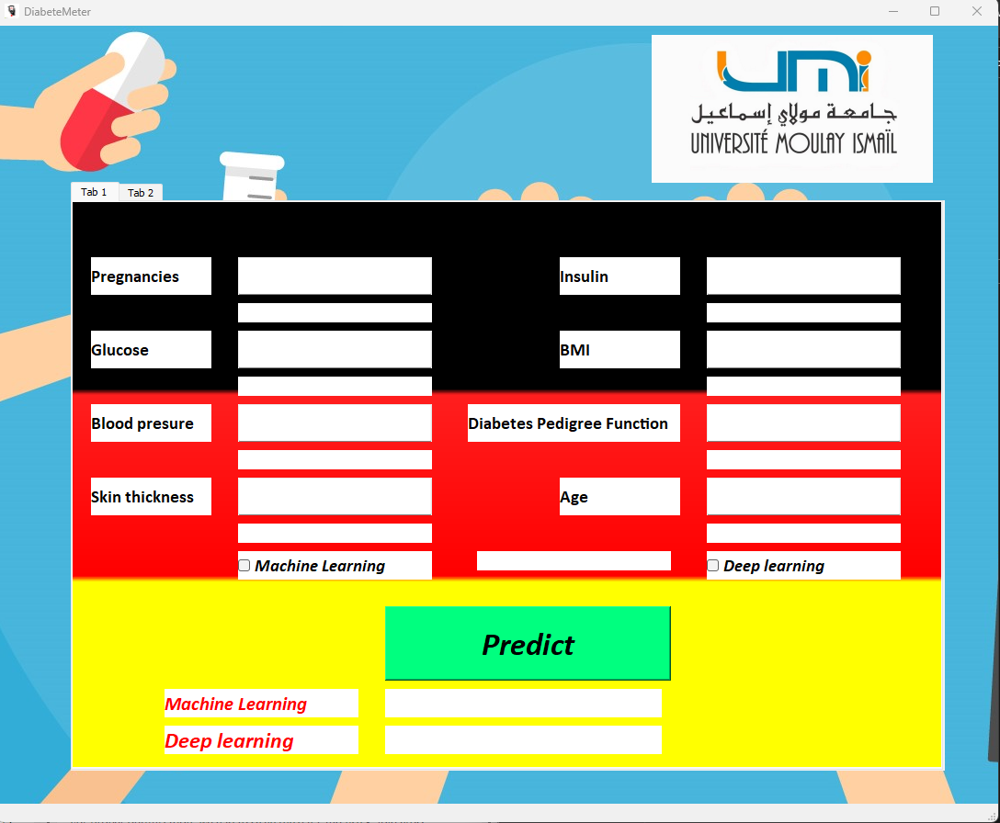

# Deployed Application Interface
After the study of the data, we have deployed our bests model in a small application with two principal functionalities, is to read data from excel or per input.
# Interfaces



# Technologies
- PyQT5
- Tensorflow
- Sklearn
- Pandas
- Pickle
- Colorama

# Requirement
- Python 3.97

# Execution
```sh
python main.py
# The application will automaticly install the necessary libraries to run
```

