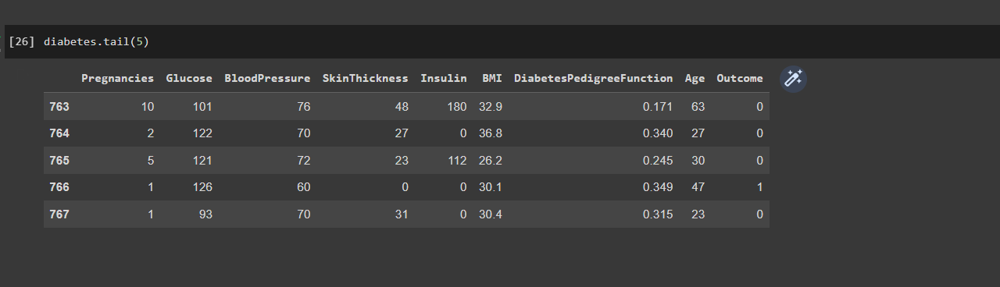
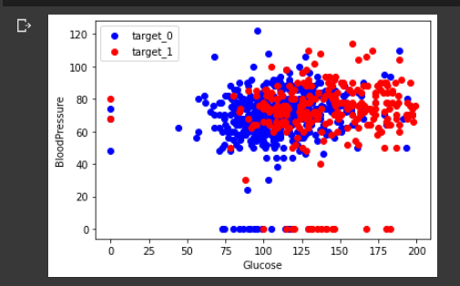
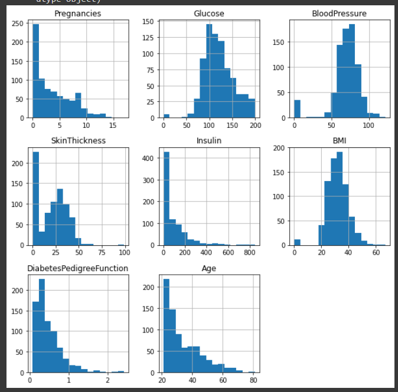
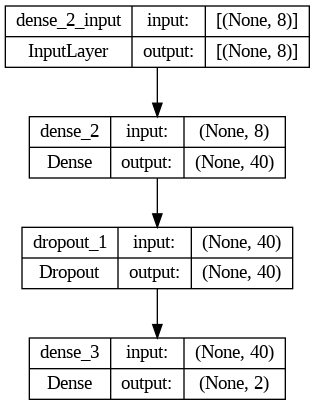
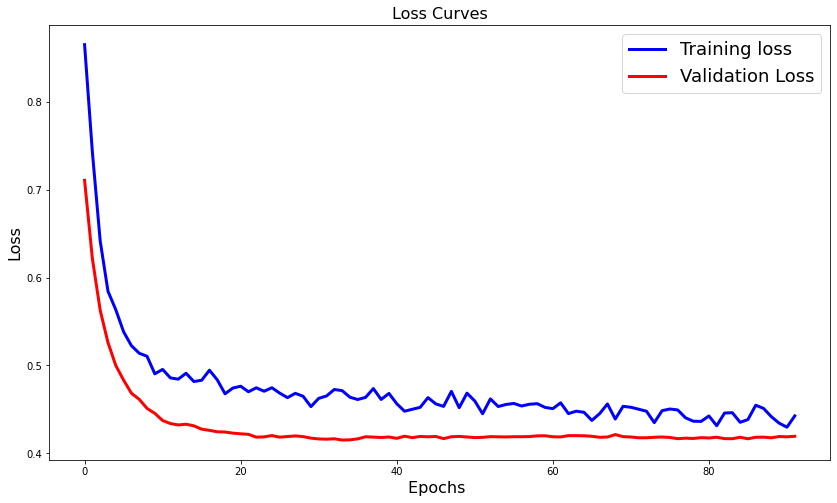

# Diabetic Patients Classification Project

In the context of my fifth semester in Morocco, our university presented an engaging artificial intelligence project designed to provide practical insights into the field. This project focuses on the creation of machine learning and deep learning models for the purpose of classifying patients as either diabetic or non-diabetic. The primary challenge involves identifying the most effective model among various options, thus facilitating informed decision-making.

## Core Functionalities

To cater to professional utilization, our task entails deploying an executable version of the application. This version allows for manual data entry or data import from an Excel file. Once the data is processed, the application predicts the likelihood of one or more patients being diabetic. This prediction is executed through two models renowned for their enhanced accuracy and ability to mitigate significant overfitting.

## Utilized Technologies

To achieve these objectives, the project has harnessed a selection of advanced technologies:

- **PyQT5**: For developing the application's user interface.
- **Tensorflow**: Empowering the implementation of deep learning models.
- **Scikit-learn (Sklearn)**: Facilitating machine learning model development and evaluation.
- **Pandas**: For data manipulation and analysis.
- **Pickle**: Enabling model serialization and deserialization.
- **Colorama**: Enhancing the visual presentation of command-line outputs.

## Model Lineup

The project capitalizes on a variety of models to achieve accurate classification:

- **Machine Learning Models**:
    - Random Forest Classifier
    - Support Vector Machine
    - Logistic Regression
    - K-Nearest Neighbors (KNN) Classifier

- **Deep Learning Model**.

## Optimization Approach

In pursuit of optimal model performance, we implemented two key strategies:

- Data Scaling: Ensuring consistent data range for effective model training.
- K-Fold Cross-Validation: Employing this technique to enhance model validation and selection.

## Data Visualization

To deepen our comprehension of the data, we present visualizations that offer valuable insights:

- **Sample Data Visualization**: Providing an illustrative snapshot of the data.
  
- **Data Dispersion Visualization**: Displaying the distribution and patterns within the data.
  
- **Data Features Visualization**: Highlighting the various features of the data.
  
- **Deep Learning Model Dense Layer**: Offering a visualization of the deep learning model's dense layer.
  
- **Deep Learning Loss Function and Estimation**: Illustrating the loss function and estimation process for the deep learning model.
  
- **ROC Curve for Decision-Making**: Utilizing the ROC curve to aid in model selection.
  

## Additional Resources

For a more detailed exploration, we offer the following resources:

- [Download Data Visualization Notebook](DataVisualisation.ipynb)
- [Access Deployed Application](Application)
- [Download Word Report](report/report.docx)
- [Download PowerPoint Report](report/report.ppt)
- [Download PDF Report](report/report.pdf)

Through this project, we've not only engaged with advanced technologies but also gained practical insights into the pivotal role of AI in healthcare decision-making.
